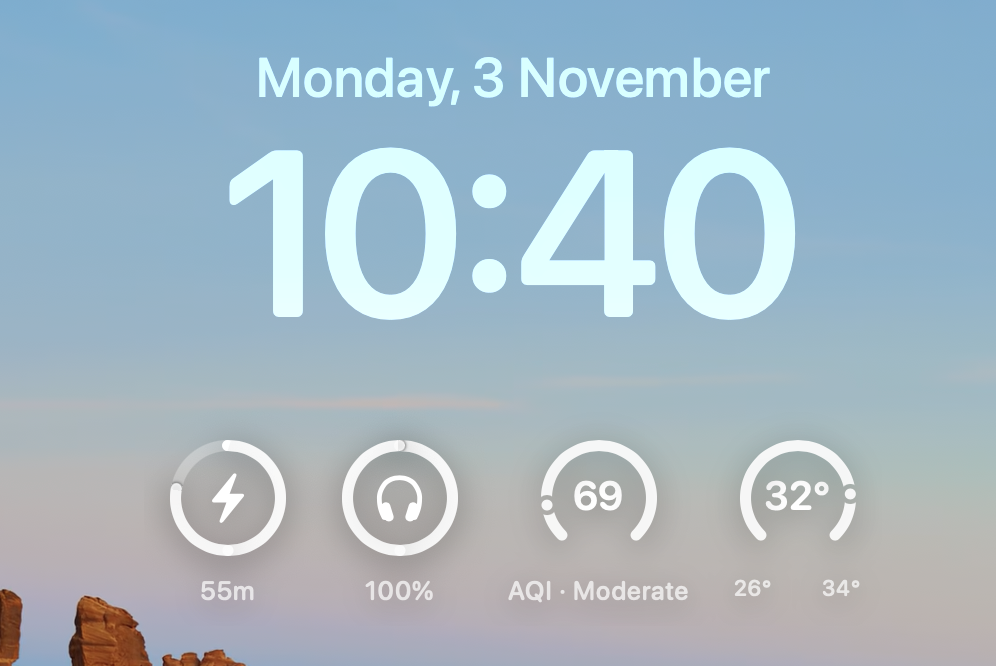

<p align="center">
  
</p>

<p align="center">
  <a href="https://github.com/Ebullioscopic/Atoll/stargazers">
    
  </a>
  <a href="https://github.com/Ebullioscopic/Atoll/network/members">
    
  </a>
  <a href="https://github.com/Ebullioscopic/Atoll/releases">
    
  </a>
  <a href="https://discord.gg/zvjB4tJBkt">
    
  </a>
</p>

<p align="center">
  <a href="https://discord.gg/zvjB4tJBkt">Join our Discord community</a>
</p>

**Project rename:** DynamicIsland is now called **Atoll**. Visit the new repository at [github.com/Ebullioscopic/Atoll](https://github.com/Ebullioscopic/Atoll).

# Atoll

Atoll transforms the MacBook notch into an interactive command surface that unifies media control, live telemetry, and productivity tools in a single SwiftUI experience.

## Overview

<p align="center">
  
</p>

Atoll runs as a menu bar companion that expands from the notch only when needed. It combines live activities, dashboard cards, and contextual panels built with first-party macOS frameworks.

The application provides a comprehensive interface for monitoring system performance, controlling media playback, managing productivity workflows, and accessing utility tools without disrupting the active workspace. Atoll leverages SwiftUI, Combine, AVFoundation, and IOKit to deliver native macOS integration with minimal performance overhead.

## Key Capabilities

### Music and media
- **Real-time playback controls** with album artwork, queues, and transport actions for Apple Music, Spotify, YouTube Music, and other media players supporting native macOS media APIs.
- **Audio visualiser** featuring dynamic spectrum analysis with colour adaptation that reflects the current track's album art palette.
- **Adaptive lighting effects** that blend artwork colours into the notch layout, creating an ambient glow effect synchronised with playback.
- **Optional compact interface** that keeps playback controls within a 420px frame (Minimalistic Mode) for users preferring a reduced notch footprint.
- **Sneak peek modes** offering standard and inline preview options that display track information without fully expanding the notch interface.
- **Multi-platform support** with automatic detection and control of active media players, including seamless switching between applications.

### System insight
- **Comprehensive monitoring** for CPU, GPU, memory, network, and disk with real-time metrics, historical graphs, and detailed breakdowns accessible through per-metric dashboards.
- **Per-core CPU utilisation** tracking with individual core activity, system load distribution, and scheduler limit indicators.
- **Temperature and frequency monitoring** derived from IOKit sensor collectors, displaying current thermal state and clock speeds across performance and efficiency cores.
- **Memory pressure analysis** including active, wired, compressed memory segments, swap activity, and cached file tracking that mirrors Activity Monitor metrics.
- **Network interface monitoring** showing upload and download throughput, session totals, local and external IP addresses, and per-interface statistics.
- **Disk I/O tracking** with read and write speeds, per-disk activity breakdowns, and storage capacity indicators.
- **Hover-triggered popovers** that present Stats-app-style dashboards with detailed grids, top process lists, and historical charts without requiring the notch to remain fully expanded.
- **Intelligent layout system** that arranges 1-3 graphs in a single row and automatically adapts to grid layouts for 4 or more active monitors, maintaining perfect centering and smooth animated transitions.
- **Customisable visibility** allowing users to toggle individual monitoring categories on or off based on workflow requirements.

<p align="center">
  
  
</p>

### Productivity tools
- **Persistent clipboard history** maintaining recent clipboard items with visual thumbnails, text previews, and one-click copy actions. Always enabled by default with configurable panel or popover display modes.
- **Precision colour picker** offering Raycast-inspired magnification, real-time pixel sampling, and multi-format export options including HEX, RGB, HSL, SwiftUI Color, UIColor, NSColor, and CSS formats. Accessible via global keyboard shortcut (default: Cmd+Shift+P) with history tracking for recently sampled colours.
- **Named timer system** supporting multiple concurrent timers with live activity indicators, customisable notification styles, colour personalisation, and background monitoring that continues even when the notch is closed.
- **Screen assistant** providing AI-powered analysis of the current display context, offering contextually relevant actions and suggestions based on visible content. Supports both panel and popover presentation modes with keyboard shortcut access.
- **Calendar integration** displaying upcoming events and schedules with permission-based access to the macOS Calendar framework.
- **Weather widget** showing current conditions and forecasts for the user's location when location access is granted.

<p align="center">
  
  
</p>

### LockScreen Widgets
- **Weather**
- **Media Player**
- **Device Charging status**
- **Bluetooth Peripheral Battery status**

<p align="center">
  
</p>

### Layout and customisation
- **Minimalistic mode** reducing the notch interface width from 640px to 420px, preserving essential music controls, HUDs, and timer functionality while removing secondary features for users prioritising visual simplicity.
- **Per-feature toggles** enabling granular control over music controls, individual stats monitoring categories (CPU, memory, GPU, network, disk), clipboard manager display, colour picker, screen assistant, timers, and other modules.
- **Adaptive hover behaviour** with adjustable sensitivity thresholds, auto-expand options on cursor proximity, and configurable grace periods that keep popovers visible during mouse transitions.
- **Visual customisation** including corner radius scaling for notch roundness, lighting effects that project album art colours, shadow intensity controls, and theme selection (light, dark, system adaptive).
- **Animation profiles** offering modern or classic close animations with smooth spring-based transitions and professionally calibrated timing curves.
- **Mirror feature** providing quick camera preview access directly from the notch interface when camera permissions are granted.
- **Profile-driven onboarding** that preconfigures the entire experience based on user selection from Developer, Designer, Light Use, or Student profiles, with multi-select support for combined feature sets.
- **Keyboard shortcut remapping** allowing users to customise hotkeys for toggling the notch, opening panels, activating the colour picker, starting timers, and launching utility tools.

### Circular widgets (lock screen)
- **Circular / Gauge styles**: Lock screen widgets now include a dedicated circular mode that uses full circular gauges for charging, Bluetooth battery, AQI, and temperature. Gauges rely on the system accessory styles to match platform appearance and respect the monochrome tint preference.
- **Inline vs circular**: Inline mode keeps icon + text on a single baseline (no gauges). Circular mode increases widget sizing to match iOS-like reference visuals and adds top padding so the widget sits visually aligned with the lock screen clock.
- **AQI & provider handling**: AQI is shown only when the Open Meteo provider is active. A provider toggle in Settings selects between Open Meteo and wttr; AQI is disabled for wttr.
- **Battery & charging behaviour**: Charging state hides the standalone battery gauge and shows charging-specific accessory circular capacity. Bluetooth circular badge displays only the icon with a surrounding progress ring; battery percentages display actual values (e.g., 100%) and adopt system colouring when appropriate.

<p align="center">
  
</p>

## Requirements
- **macOS Sonoma 14.0** or later, optimised for macOS Sequoia 15.0 and subsequent releases.
- **MacBook with notch** including 14-inch and 16-inch MacBook Pro models across M1 Pro, M1 Max, M2 Pro, M2 Max, M3 Pro, M3 Max, M4 Pro, and M4 Max configurations.
- **Xcode 15.0** or later with Swift 5.9 toolchain for building from source.
- **Administrative privileges** for enabling system monitoring features that access IOKit sensors and performance metrics.
- **Optional permissions** for full functionality: Accessibility (colour picker, screen assistant), Camera (mirror feature), Calendar (event integration), Screen Recording (advanced monitoring), and Music Library (media controls).

## Installation
1. Clone the repository and open the project.
   ```bash
   git clone https://github.com/Ebullioscopic/Atoll.git
   cd Atoll
   open DynamicIsland.xcodeproj
   ```
2. Select your Mac as the run destination in Xcode.
3. Build and run (Command + R). Grant any prompted permissions.
4. The Atoll icon appears in the menu bar; the notch interface will activate when the pointer approaches the notch.

## Usage

### Basic interaction
- **Hover activation**: Move the cursor near the notch area to expand Atoll and reveal active modules. Hover sensitivity is adjustable in Settings.
- **Click to expand**: Tap the notch surface to access full controls and switch between tabs.
- **Gesture support**: Swipe down to expand, swipe up to close, and use haptic feedback when enabled.
- **Tab navigation**: Switch between Home (media controls), Stats (system monitoring), Timers, Clipboard, and utility panels.

### First launch setup
1. Select one or more user profiles (Developer, Designer, Light Use, Student) during onboarding to preconfigure feature sets.
2. Grant requested permissions for Camera (mirror feature), Calendar (event display), Music (playback controls), and Accessibility (colour picker, screen assistant).
3. Review privacy policy links and complete the guided setup process.
4. Customise additional settings from the menu bar icon if the default profile configuration requires adjustment.

### Music and media
- Album artwork, track metadata, and transport controls appear automatically when a supported media player begins playback.
- Enable the audio visualiser in Settings to display real-time spectrum analysis.
- Toggle Minimalistic Mode to reduce the notch width to 420px while retaining playback controls.
- Use Sneak Peek for quick track information without fully expanding the interface.

### System monitoring
- Access the Stats tab to view real-time CPU, memory, GPU, network, and disk metrics with live graphs.
- Click individual metric cards to open detailed popovers displaying per-core usage, temperature, frequency, memory breakdowns, network interfaces, or disk activity.
- Enable or disable specific monitoring categories from Settings to reduce resource usage or declutter the interface.
- Open the floating Stats Panel from the menu bar or keyboard shortcut for persistent monitoring in a separate window.

### Colour picker
- Press Cmd+Shift+P (or your custom shortcut) to activate the colour picker.
- Move the cursor to sample any pixel on screen with real-time magnification.
- Click to capture the colour and copy it to the clipboard in your preferred format.
- Access recently sampled colours from the history panel and click any entry to copy it again.
- Switch between panel (floating window) and popover (integrated notch) display modes in Settings.

### Clipboard manager
- Clipboard history tracking is enabled by default and operates continuously in the background.
- Access the clipboard panel via keyboard shortcut or the Clipboard tab in the notch interface.
- Click any history item to copy it to the clipboard, or use keyboard shortcuts for rapid pasting.
- Visual thumbnails display for images and formatted content, with text previews for plain text entries.

### Timers
- Create named timers with custom durations, notification styles, and colour schemes.
- Start, pause, or reset timers from the Timer tab or menu bar shortcuts.
- Timers continue running as live activities even when the notch is closed, with notifications at completion.
- Manage multiple concurrent timers and view remaining time for all active timers at a glance.

- Timer controls live in a right-side popover alongside other notch icons and are also available from the menu bar. Timers run as live activities when the notch is closed: the timer icon remains neutral when idle and adopts the configured tint while running.

- Progress and display options: choose circular ring or linear bar progress, toggle countdown text on/off, and allow the ring size to adapt to title width to avoid overlap with the notch.

- Settings: timer tint (gradient vs solid), progress style (circular or bar), and countdown visibility.

<p align="center">
  
</p>

### Customisation
- Open Settings from the menu bar icon to adjust features, appearance, behaviour, keyboard shortcuts, and privacy permissions.
- Switch between user profiles to quickly reconfigure the entire interface for different workflows.
- Enable or disable Minimalistic Mode to toggle between full-featured and compact layouts.
- Customise hover sensitivity, lighting effects, shadows, animation styles, and theme selection.
- Remap all keyboard shortcuts to avoid conflicts with other applications or personal preferences.

## Configuration

### Settings categories

#### General
- **Menu bar icon visibility**: Show or hide the Atoll icon in the macOS menu bar.
- **Multi-display support**: Select the primary monitor for notch placement or enable display across all connected screens.
- **User profile selection**: Switch between Developer, Designer, Light Use, or Student profiles to reconfigure the entire feature set.
- **Launch at login**: Automatically start Atoll when the system boots.

#### Appearance
- **Minimalistic mode**: Toggle between full-featured (640px) and compact (420px) notch layouts.
- **Corner radius scaling**: Adjust the roundness of the notch interface corners using a slider control.
- **Lighting effects**: Enable album art glow projection that blends artwork colours into the notch background during media playback.
- **Shadow effects**: Control drop shadow intensity for depth perception.
- **Theme selection**: Choose between light, dark, or system-adaptive appearance.
- **Mirror feature**: Toggle camera preview access from the notch interface.
- **Animation style**: Select modern (spring-based) or classic (linear) close animations.

#### Behaviour
- **Hover sensitivity**: Adjust the distance threshold for automatic notch expansion when the cursor approaches.
- **Auto-expand on hover**: Enable or disable automatic expansion, requiring explicit clicks instead.
- **Haptic feedback**: Toggle haptic responses for interaction events when supported by hardware.
- **Gesture controls**: Configure swipe directions and tap actions for notch navigation.
- **Popover grace periods**: Set hover delay times that keep popovers visible during cursor transitions.

#### Features
- **Music controls**: Enable playback integration with supported media players.
- **Audio visualiser**: Toggle spectrum analysis display and select visualisation type.
- **Stats monitoring**: Independently enable or disable CPU, Memory, GPU, Network, and Disk monitoring categories.
- **Clipboard manager**: Configure display mode (panel or popover) and history retention settings.
- **Colour picker**: Enable feature, set keyboard shortcut, and choose panel or popover presentation.
- **Screen assistant**: Enable AI-powered analysis and configure keyboard shortcut access.
- **Timer system**: Set default durations, notification styles, and colour preferences.
- **Calendar integration**: Enable event display and configure update frequency.
- **Weather widget**: Enable location-based weather information when location permissions are granted.

#### Keyboard shortcuts
- **Toggle notch**: Global shortcut to open or close the Atoll interface.
- **Sneak peek**: Quick preview toggle without full expansion.
- **Clipboard panel**: Direct access to clipboard history.
- **Colour picker activation**: Launch colour sampling tool (default: Cmd+Shift+P).
- **Screen assistant**: Open AI analysis interface.
- **Stats panel**: Toggle floating system monitoring window.
- **Demo timer**: Start a predefined 5-minute timer for quick access.
- **Custom remapping**: All shortcuts support user-defined key combinations to avoid conflicts with existing applications.

#### Privacy and permissions
- **Accessibility**: Required for colour picker and screen assistant functionality. Grant in System Settings → Privacy & Security → Accessibility.
- **Screen recording**: Optional for advanced monitoring features and screen content analysis.
- **Camera**: Required for mirror feature. Grant in System Settings → Privacy & Security → Camera.
- **Calendar**: Required for event integration. Grant in System Settings → Privacy & Security → Calendar.
- **Music library**: Required for media playback controls. Atoll automatically requests permission on first media interaction.

### Reset to defaults
Execute the included shell script to clear all user preferences and restore factory settings:
```bash
cd /path/to/Atoll
./reset_app_defaults.sh
```
This operation clears UserDefaults, removes application support files and caches, deletes preferences, and triggers the onboarding flow on next launch.

## Troubleshooting

### Common issues

#### Permissions not recognised
- **Accessibility permission**: Required for colour picker and screen assistant. Navigate to System Settings → Privacy & Security → Accessibility, enable Atoll, then **quit and restart** the application. Permission changes require a full restart to take effect.
- **Screen recording permission**: Optional for advanced monitoring features. Grant in System Settings → Privacy & Security → Screen Recording.
- **Camera permission**: Required for mirror feature. Grant in System Settings → Privacy & Security → Camera if prompted.
- **Calendar permission**: Required for event display. Grant in System Settings → Privacy & Security → Calendar.
- **Music permission**: Automatically requested when media controls are first used. Grant when prompted.

#### Stats monitoring shows zero values
- Verify that individual stats categories are enabled in Settings → Features → Stats Monitoring.
- Confirm the Stats feature toggle is enabled globally.
- Restart monitoring from Settings → Features → Restart Monitoring if metrics fail to update.
- Check Activity Monitor to ensure Atoll has sufficient permissions and is not being throttled by the system.
- For CPU temperature and frequency: ensure IOKit sensors are accessible and not blocked by security software.

#### Music controls not responding
- Confirm a supported media player (Apple Music, Spotify, YouTube Music, etc.) is actively playing content.
- Verify Music permission is granted in System Settings → Privacy & Security → Music.
- Restart both Atoll and the media player application.
- Try switching playback between different media applications to verify detection.
- Check that media controls are enabled in Settings → Features → Music Controls.

#### Colour picker fails to activate
- Grant Accessibility permission in System Settings → Privacy & Security → Accessibility.
- **Critical**: Quit Atoll completely and relaunch after granting permission. Permission changes require application restart.
- Verify the keyboard shortcut (default: Cmd+Shift+P) is not conflicting with other applications.
- Confirm the Colour Picker feature is enabled in Settings → Features.
- Check Console.app for error messages if activation continues to fail.

#### Notch positioning incorrect after resolution changes
- Recent updates resolve notch positioning automatically when display configurations change.
- If positioning issues persist, quit and relaunch Atoll to recalculate the notch location.
- Verify multi-display settings in Settings → General if using external monitors.

#### Performance degradation
- Reduce stats update frequency in Settings → Features → Stats Monitoring to decrease polling overhead.
- Disable unused monitoring categories (GPU, Network, Disk) if not required.
- Enable Minimalistic Mode in Settings → Appearance to reduce resource usage.
- Disable audio visualiser in Settings → Features → Music Controls if experiencing playback issues.
- Close other resource-intensive applications that may compete for system resources.
- Monitor Atoll's resource usage in Activity Monitor; sustained high CPU or memory usage indicates a configuration issue.

#### Configuration becomes inconsistent
- Run the reset script to restore factory defaults:
  ```bash
  cd /path/to/Atoll
  ./reset_app_defaults.sh
  ```
- This clears all UserDefaults, removes application support files and caches, and triggers onboarding on next launch.
- Alternatively, manually delete preferences:
  ```bash
  defaults delete com.karthikinformationtechnology.DynamicIsland
  rm -rf ~/Library/Application\ Support/DynamicIsland
  rm -rf ~/Library/Caches/com.karthikinformationtechnology.DynamicIsland
  rm -f ~/Library/Preferences/com.karthikinformationtechnology.DynamicIsland.plist
  ```

### Debug mode
- Hold Option (⌥) while opening Settings to reveal advanced debugging options.
- Enable verbose logging to capture detailed event traces in Console.app.
- Search Console.app for process name "DynamicIsland" to filter relevant log entries.
- Report persistent issues with Console logs attached at the project's GitHub Issues page.

## License
Atoll is released under the GPL v3 License. Refer to [LICENSE](LICENSE) for the full terms.

## Acknowledgments

Atoll builds upon the work of several open-source projects and draws inspiration from innovative macOS applications:

- [**Boring.Notch**](https://github.com/TheBoredTeam/boring.notch) - foundational codebase that provided the initial media player integration, AirDrop surface implementation, file dock functionality, and calendar event display. Major architectural patterns and notch interaction models were adapted from this project.

- [**Alcove**](https://tryalcove.com) - primary inspiration for the Minimalistic Mode interface design and the conceptual framework for lock screen widget integration that informed Atoll's compact layout strategy.

- [**Stats**](https://github.com/exelban/stats) - source implementation for CPU temperature monitoring via SMC (System Management Controller) access, frequency sampling through IOReport bindings, and per-core CPU utilisation tracking. The system metrics collection architecture derives from Stats project readers.

## Contributors

<a href="https://github.com/Ebullioscopic/Atoll/graphs/contributors">
  
</a>

## Star History

[](https://www.star-history.com/#Ebullioscopic/Atoll&type=timeline&legend=top-left)

## Updating Existing Clones
If you previously cloned DynamicIsland, update the remote to track the Atoll repository:

```bash
git remote set-url origin https://github.com/Ebullioscopic/Atoll.git
```

A heartfelt thanks to [TheBoredTeam](https://github.com/TheBoredTeam) for being supportive and being totally awesome, Atoll would not have been possible without Boring.Notch